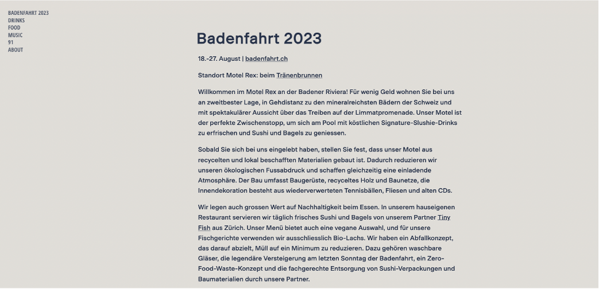

# Website - Motel Rex - Badenfahrt 2023

See the website here: https://motel-rex.netlify.app/

Website done with `blogdown` and based on [Hugo Scroll](https://themes.gohugo.io/themes/hugo-scroll/) by [Jan Raasch](https://www.janraasch.com/)

# Notes

What to find where...

## Content
* to change actual title! --> content/_index.md

* content/homepage: add topic pages, e.g. drink in form of an .md file.

## Images
static/images

change picture at top/header --> content/_index.md

## Fonts & Size

It is possible to customize everything in the custom_head.html, and for default options see screen.css.

* in layouts/partials/custom_head.html using "font-family: ..."

* themes/hugo-scroll/layouts/index.html: e.g. size of post titles h2 etc.
* themes/hugo-scroll/static/css/fonts.css
* themes/hugo-scroll/static/css/screen.css

## Colors
* layouts/partials/custom_head.html

## Header & Footer
* footer: themes/hugo-scroll/layouts/partials/footer.html

